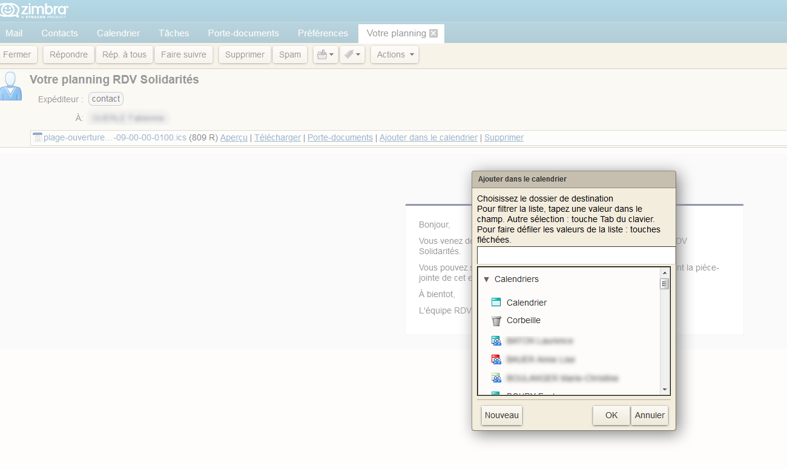
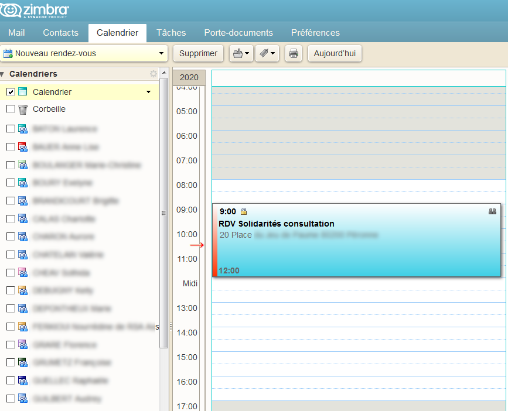

# Interconnexion par email et icalendar

En plus des webhooks, RDV-solidarités peut envoyer des emails aux agents après qu’un rendez-vous a été posé ou modifié, ou lorsqu’une plage d’ouverture est créée ou modifiée. De la même façon, un email est envoyé aux usagers concernés par un rendez-vous.

Ces emails contiennent les informations de l’_évènement_, c’est-à-dire le rendez-vous, la plage d’ouverture ou l’absence, au format icalendar. Elles sont incluses dans le mail en double: une fois en pièce jointe sous forme d’un fichier .ics, une fois en _part_ `text/calendar`. Ce sont les mêmes informations, dupliquées: le but est d’assurer une meilleure compatibilité avec les différents logiciels de calendrier. N’hésitez pas à nous contacter si quelque chose ne fonctionne pas parfaitement chez vous.

En images, le comportement sur Zimbra de l’ajout manuel d’une plage d’ouverture créée dans RDV-solidarités:

