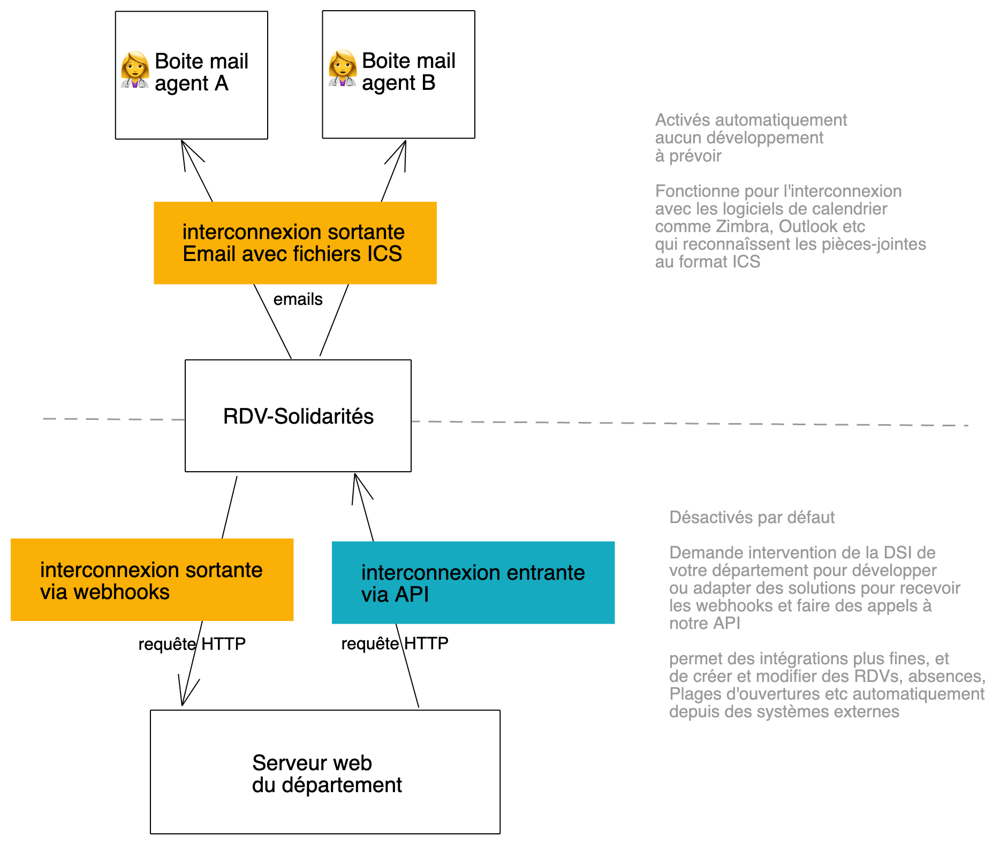

# Interconnexions aperçu

Cette page est une vue d'ensemble des possibilités d'interconnexion de RDV-Solidarités avec vos SI existants

## Interconnexion sortante via email

Cette interconnexion est activée automatiquement. Elle fonctionne pour l'interconnexion avec les logiciels de calendrier comme Zimbra, Outlook etc qui reconnaîssent les pièces-jointes au format ICS

## Interconnexion sortante via webhooks

Désactivée par défaut. Nécessite l'intervention de la DSI de votre département pour développer ou adapter des solutions pour recevoir les requêtes webhooks envoyée par RDV-Solidarités

Si vous avez besoin d'autoriser les requêtes de RDV-Solidarités à entrer sur votre réseau, vous trouverez les IP à autoriser sur la page de notre hébergeur [https://doc.scalingo.com/platform/internals/network\#outgoing-ip-addresses-range](https://doc.scalingo.com/platform/internals/network#outgoing-ip-addresses-range) RDV-Solidarité est hébergé sur la region SecNumCloud \(osc-secnum-fr1\).

[api-interconnexions-sortantes](/api-interconnexions-sortantes)

## Interconnexion entrante via API

Désactivée par défaut. Nécessite l'intervention de la DSI de votre département pour développer ou adapter des solutions pour faire des appels à l'API de RDV-Solidarités

Elle permet des intégrations plus fines, et de créer et modifier des RDVs, absences, plages d'ouvertures etc... automatiquement depuis des systèmes externes

[api-interconnexions-entrantes](/api-interconnexions-entrantes)

